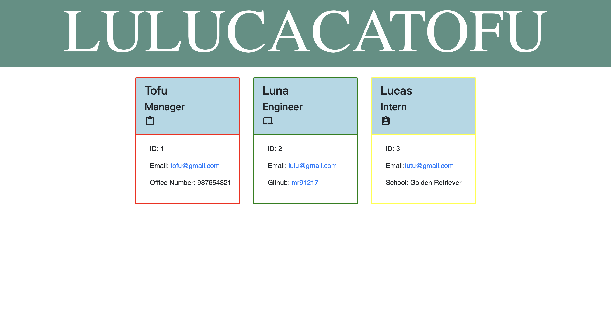

<h1 align="center">Team-Profile-Generator</h1>
 
## User Story
  
```
AS A manager
I WANT to generate a webpage that displays my team's basic info
SO THAT I have quick access to their emails and GitHub profiles
```

## Description
  A node.js application that uses user input from inquirer to populate a HTML file for user. The HTML file is created in the dist directory 
## Video
[Click here for Video](https://mr91217.github.io/Team-Profile-Generator/)
## Screenshot

## Table of Contents
- [Description](#description)
- [Installation](#installation)
- [Usage](#usage)
- [Languages](#languages)
- [Contributing](#contributing)
- [Reference](#reference)
- [Questions](#questions)
## Installation
  `npm init`
  
  `npm install inquirer`
## Usage
  Run the following command at th root of your project and answer the prompted questions:<br />

  `node index.js`

  `node index`
## Languages
  JavaScript,Node,HTML,CSS
## Contributing
  ChunYu Chang
## Reference
  https://github.com/mattbeachey/Team-Profile-Generator <br />
  Class Moudles
## Questions
 Contact me<br />

## Contact
GitHub: [mr91217](https://github.com/mr91217)<br />
<br />
Email: mr91217@gmail.com<br />
<br />
   